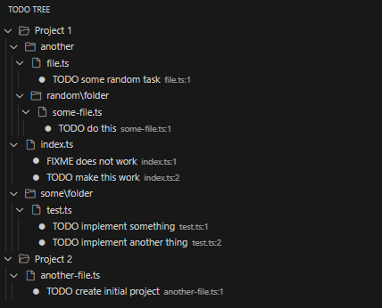

# Simple Todo Tree

**Supports multi project workspaces**

## Extension Settings

* `simpleTodoTree.includePatterns`: A list of glob patterns that will be used to include files in the tree view. For example, `["**/*.js"]` will include all files with a `.js` extension.
* `simpleTodoTree.excludePatterns`: A list of glob patterns that will be used to exclude files from the tree view. For example, `["**/node_modules/**"]` will exclude all files in the `node_modules` directory.
* `simpleTodoTree.todoPatterns`: A list of glob patterns that will be used to match TODO comments in the files. For example, `["TODO"]` will match every line that contains the word "TODO". (eg: "// TODO: Implement this feature")
* `simpleTodoTree.debounceDelay`: The delay in milliseconds before the tree view is updated after a file change. This can help improve performance when working with large projects. Default is `500` milliseconds.

## Known Issues

Nothing known so far.
